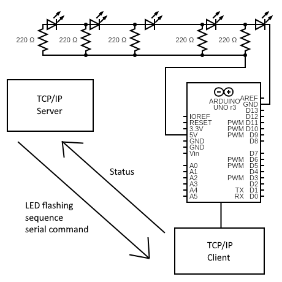

# Arduino Socket Controller
## Overview

A TCP/IP server that sends commands to an Arduino board that parses the command using a serial port connection.

## Schematic

## Tools Used
A serial port interface that can be remotely operated via a socket connection. 

This interface uses the [Winsock](https://docs.microsoft.com/en-us/windows/win32/winsock/about-winsock "Winsock Documentation") 
library for C++ to handle client-server communications while using the 
[.NET](https://docs.microsoft.com/en-us/dotnet/standard/class-library-overview) library to handle I/O on the serial ports.
